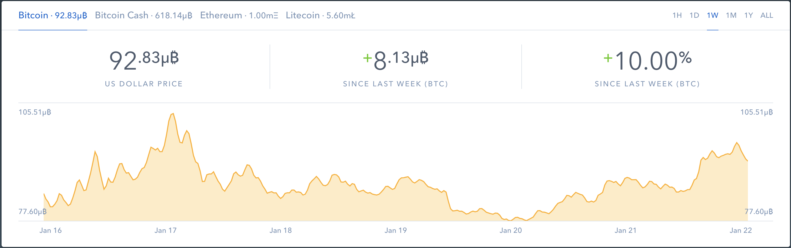

# coincharts

A cryptocurrency price chart built with [React.js](https://facebook.github.io/react/), [D3.js](https://d3js.org/) & [Coinbase API](https://developers.coinbase.com/api/v2).

- Bootstrapped with [create-react-app](https://github.com/facebookincubator/create-react-app)
- UI design based off [https://www.coinbase.com/charts](https://www.coinbase.com/charts)

<p align="center">
  
</p>

## Installation

Prerequisites: [Node](https://nodejs.org/en/download/) & [yarn](https://docs.yarnjs.com/getting-started/installing-node) installed on your system.

``` bash
git clone https://github.com/aeftimia/howsthedollar.com.git && cd ./howsthedollar.com
yarn install
```

## Getting Started

``` bash
# Runs the app in development mode at `localhost:3000`
yarn start

# Takes a snapshot of responses from coinbase API & saves them into JSON files in `public/priceData` (for offline development)
yarn updatePriceData

# Create production build in `/build` folder
yarn build

# Serve production build at `localhost:5000`
yarn serve

# Deploy app with `firebase` using configuration defined in `firebase.json`
yarn deploy
```
